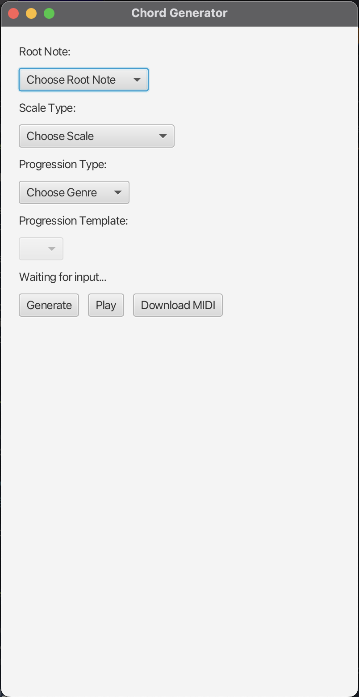

# 🎵 Chord Generator

**Chord Generator** is a JavaFX desktop application that allows users to generate chord progressions based on a chosen root note, scale type, and genre. The app converts chord progressions into MIDI files using JFugue and supports live playback and MIDI export in Format 1, compatible with DAWs like Ableton.


## ✨ Features

- 🎹 Selectable root note and scale type
- 🎼 Choose from genres like Pop, Rock, R&B, Jazz, and Classical
- 🔢 Dynamically update available chord progression templates per genre
- ▶️ Playback generated chord progressions using JFugue
- 💾 Export to **Format 1 MIDI**, playable in all major DAWs
- 🎛️ Simple and responsive JavaFX interface

## 🖼️ UI Preview



---

## 🚀 Getting Started

### 📦 Prerequisites

- Java 17+
- JavaFX SDK
- Maven
- JFugue (automatically included via Maven)

```bash
mvn clean install
mvn exec:java
```

### 📦 Folder Structure

```plaintext
src/
├── main/
│   ├── java/
│   │   └── com.chordgenerator
│   │       ├── app/                     # JavaFX GUI code
│   │       │   └── ChordGeneratorApp.java
│   │       ├── generators/              # Chord generation logic
│   │       │   ├── ChordGenerator.java
│   │       │   └── ChordProgressionGenerator.java
│   │       └── export/                  # MIDI exporting
│   │           └── MidiExporter.java
│   └── resources/
└── test/
```

## 🧠 How It Works

- The app uses pre-defined chord progression templates for different genres.
- Users pick a genre and are shown relevant Roman numeral-based progressions.
- These progressions are mapped to scale degrees using ChordGenerator.
- A JFugue Pattern is built using these chords and played or exported to MIDI.

## 📤 Exporting to MIDI
The Exported MIDI file:
- Is in Format 1
- Is compatible with all modern DAWs like Ableton, FL Studio, etc.

## 🎵 Dependencies

- JavaFX – GUI framework
- JFugue – MIDI and music pattern manipulation
- javax.sound.midi – MIDI writing
> Maven handles dependencies

### 📜 License
MIT — free to use and share.

### 👋 Author
@chrispugliese

